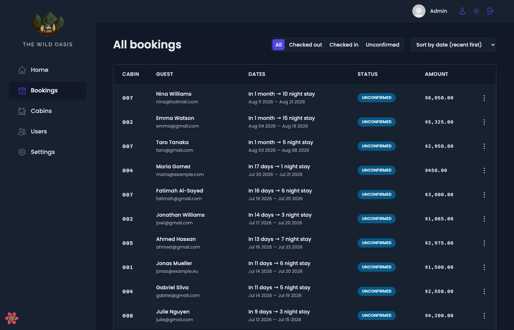
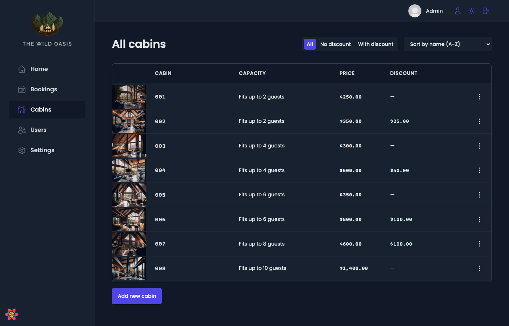
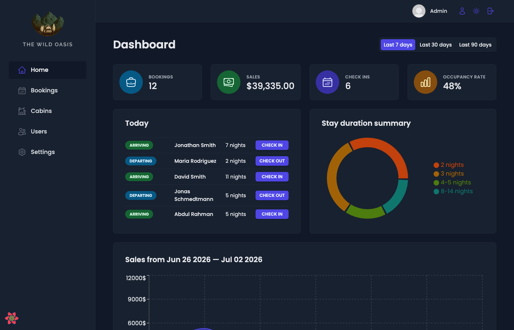

# The Wild Oasis

## About the Project

The Wild Oasis is a full-stack internal hotel management dashboard built for a boutique hotel/lodge. It serves as a back-office tool where hotel staff can manage every aspect of daily operations — from tracking guest bookings and handling check-ins/check-outs to managing cabins, monitoring business performance through analytics, and configuring hotel-wide settings.

The app features a clean, modern UI with light and dark modes, real-time data fetching, and a fully protected authentication system ensuring only authorized staff can access sensitive hotel data.

## Why This Project Matters

This project demonstrates how modern front-end tooling and a backend-as-a-service platform can come together to build a production-grade application that is:

- **Performant** — Server state is cached and synchronized via React Query, minimizing unnecessary network requests while keeping data fresh. The app feels fast and responsive.
- **Scalable** — Features are organized into self-contained domain modules (authentication, bookings, cabins, check-in/out, dashboard, settings), each with its own components, hooks, and API logic. New features can be added without touching unrelated code.
- **Maintainable** — A clear separation of concerns keeps the codebase clean: `ui/` holds reusable generic components, `features/` groups domain logic, `services/` isolates the API layer, and `hooks/` shares cross-cutting utilities.
- **Real-world Ready** — Handles edge cases like loading states, empty states, error boundaries, form validation, optimistic updates, and pagination — all essential for any application used in a real business environment.

## Technologies & Rationale

| Technology | Why It Was Chosen |
|---|---|
| **React 18** | Component-based architecture for building a complex, interactive UI. React's ecosystem and community make it the go-to choice for SPAs. |
| **Vite** | Ultra-fast dev server with HMR (Hot Module Replacement) and optimized production builds. Significantly faster than Webpack/CRA for development. |
| **React Router v6** | Declarative client-side routing with nested layouts, protected routes, and URL-based navigation — essential for a multi-page dashboard. |
| **TanStack React Query v4** | Handles server state management (caching, background refetching, mutations, optimistic updates) out of the box. Eliminates the need for manual `useEffect` + `useState` patterns for API calls and keeps the UI synced with the backend. |
| **Supabase** | An open-source Firebase alternative providing PostgreSQL database, authentication, and file storage. Using it as a backend-as-a-service eliminates the need for a custom API server — the client talks directly to the database via the Supabase JS SDK with Row Level Security. |
| **styled-components v5** | CSS-in-JS library that allows writing actual CSS inside components. Co-located styles, dynamic theming (light/dark mode via CSS custom properties), and no class-name collisions. |
| **React Hook Form v7** | Performant form management with minimal re-renders by using uncontrolled inputs under the hood. Handles validation, submission, and error states with a clean API. |
| **Recharts v2** | Composable charting library built on React and D3. Used for the dashboard's stay duration pie chart and sales trend area chart. |
| **react-hot-toast** | Lightweight, customizable toast notification system for user feedback on mutations (create, update, delete, login, etc.). |
| **date-fns** | Modular date utility library (no moment.js bloat). Used for date comparisons, formatting, and calculations across bookings and the dashboard. |
| **react-icons** | Provides the Heroicons v2 icon set used throughout the UI (sidebar navigation, buttons, status indicators). |
| **react-error-boundary** | Graceful error handling at the component level — catches render errors and displays a fallback UI instead of a white screen.

## Demo Credentials

- **Email:** admin@gmail.com
- **Password:** pass1234

## Features

- **Dashboard** — Overview analytics with stats cards, stay duration pie chart, sales trend chart, and today's activity. Filterable by last 7/30/90 days.
- **Bookings** — Full CRUD table of guest bookings with filtering (status), sorting, and pagination.
- **Check-in/out** — Guest check-in workflow (confirm payment, optional breakfast) and checkout.
- **Cabins** — CRUD table for managing hotel cabins with image upload.
- **Settings** — Hotel-wide configuration (min/max nights, max guests, breakfast price).
- **Authentication** — Staff login/signup, profile updates (name, avatar, password).
- **Dark mode** — Light/dark theme toggle persisted in localStorage.

## Screenshots

### Dashboard


### Bookings



### Cabins



### Login



## Getting Started

A Supabase backend is optional — the app ships with mock data and works out of the box.

### Quick Start (with mock data)

1. **Install dependencies**
   ```bash
   npm install
   ```

2. **Run the development server**
   ```bash
   npm run dev
   ```

3. Open **http://localhost:5173** and log in with:
   - **Email:** `admin@gmail.com`
   - **Password:** `pass1234`

### With Supabase

1. **Clone the repo**
   ```bash
   git clone <repo-url>
   cd the-wild-oasis
   ```

2. **Install dependencies**
   ```bash
   npm install
   ```

3. **Configure Supabase**

   Update `src/services/supabase.js` with your Supabase project URL and anon key:
   ```js
   const supabaseUrl = "https://<your-project>.supabase.co";
   const supabaseKey = "<your-anon-key>";
   ```

4. **Create the admin user**

   In your Supabase project dashboard under **Authentication → Users**, create a user with:
   - Email: `admin@gmail.com`
   - Password: `pass1234`

5. **Run the development server**
   ```bash
   npm run dev
   ```

### Seed Data

The app includes a built-in uploader for sample data. After logging in, use the **Upload ALL** button in the sidebar to populate the database with sample guests, cabins, and bookings.

### Scripts

| Command | Description |
|---|---|
| `npm run dev` | Start Vite dev server |
| `npm run build` | Build for production |
| `npm run preview` | Preview production build |

## Project Structure

```
src/
├── features/        # Domain feature modules (auth, bookings, cabins, etc.)
│   ├── authentication/
│   ├── bookings/
│   ├── cabins/
│   ├── check-in-out/
│   ├── dashboard/
│   └── settings/
├── pages/           # Route-level page components
├── services/        # Supabase API layer
├── ui/              # Reusable generic UI components
├── hooks/           # Shared custom hooks
├── context/         # React context (dark mode)
├── styles/          # Global styles
├── data/            # Seed data + uploader utility
└── utils/           # Constants and helpers
```
